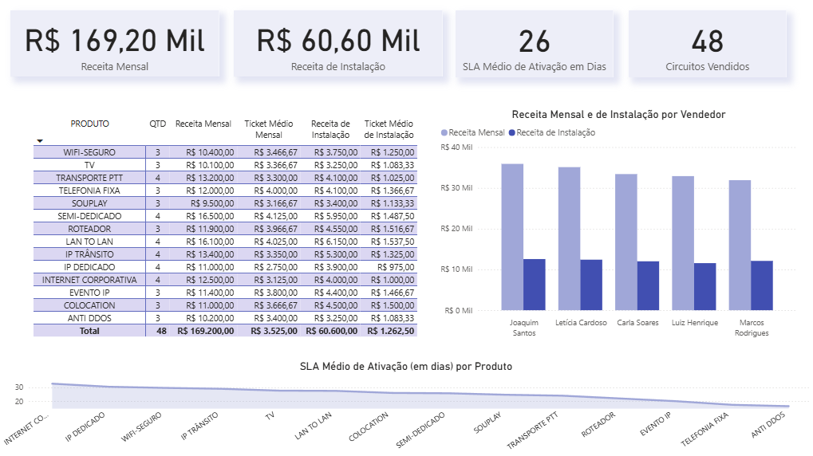
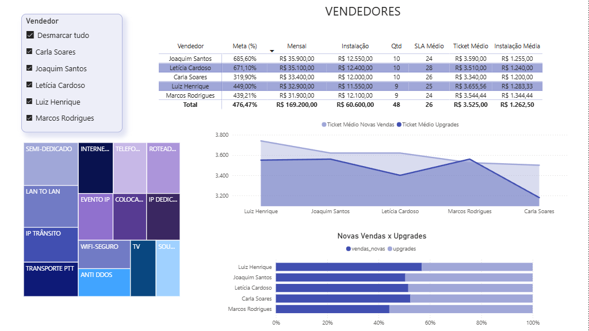

# Sales Analytics API & BI Dashboard


## 📊 Visão Geral do Projeto

Este projeto consiste em uma **API de alta performance** construída com FastAPI que serve como um backend robusto para um **dashboard de Business Intelligence em Power BI**. A solução simula um ambiente real de análise de vendas, onde o backend se conecta a um banco de dados PostgreSQL para extrair dados de vendas, produtos e vendedores, e os expõe de forma segura para consumo por ferramentas de BI.

O resultado final é um pipeline de dados completo: do banco de dados relacional, passando por uma API segura e bem estruturada, até a visualização de KPIs e métricas de negócio em um dashboard interativo.

###  Dashboards Finais

- Dashboard de Visão Geral


- Dashboard de Análise de Vendedores


## ✨ Features

* **API RESTful** com FastAPI, seguindo as melhores práticas de estrutura de projetos.
* **Banco de Dados PostgreSQL** como fonte da verdade para os dados de negócio.
* **Consultas com SQL Puro** via `psycopg2`, demonstrando controle e otimização das queries.
* **Validação de Dados** robusta com Pydantic para garantir a integridade dos schemas da API.
* **Autenticação Segura** via API Key para proteger os endpoints contra acesso não autorizado.
* **Documentação Automática** e interativa com Swagger UI (`/docs`).
* **Código Refatorado e Limpo**, utilizando funções base para evitar repetição (princípio DRY).
* **Pipeline de BI Completo**, com integração ponta-a-ponta com o Power BI para criação de um modelo de dados relacional e visuais dinâmicos.

## 🛠️ Tech Stack

* **Backend:** FastAPI, Uvicorn, Gunicorn
* **Banco de Dados:** PostgreSQL
* **Driver do Banco:** Psycopg2
* **Validação/Configuração:** Pydantic, Pydantic-Settings
* **Visualização:** Power BI
* **Cloud (Deploy):** Railway.com

## 🚀 Como Executar Localmente

Siga os passos abaixo para configurar e rodar o projeto na sua máquina.

### Pré-requisitos
* Python 3.10+
* PostgreSQL
* Power BI Desktop

### 1. Clonar o Repositório
```bash
git clone [https://github.com/seu-usuario/sales-analytics-service.git](https://github.com/seu-usuario/sales-analytics-service.git)
cd sales-analytics-service
```

### 2. Ambiente Virtual e Dependências
```bash
# Crie e ative o ambiente virtual
python -m venv venv
.\venv\Scripts\activate

# Instale as bibliotecas
pip install -r requirements.txt
```

### 3. Banco de Dados
1. Crie um banco de dados no PostgreSQL (ex: `sales_analytics_api_db`).
2. Execute o script `database/schema.sql` neste banco para criar as tabelas e inserir os dados de exemplo.

### 4. Variáveis de Ambiente
1. Crie uma cópia do arquivo `.env.example` (se houver) ou crie um novo arquivo chamado `.env` na raiz do projeto.
2. Preencha o `.env` com suas credenciais:
```ini
POSTGRES_USER=seu_usuario
POSTGRES_PASSWORD=sua_senha
POSTGRES_SERVER=localhost
POSTGRES_PORT=5432
POSTGRES_DB=sales_analytics_api_db
API_KEY="uma_chave_secreta_bem_forte_aqui"
```

### 5. Iniciar a API
```bash
uvicorn app.main:app --reload
```
A API estará rodando localmente em `http://127.0.0.1:8000` e a documentação em `http://127.0.0.1:8000/docs`.


## 🔗 Links do Projeto Online

* **Dashboard Interativo:** **[Clique aqui para acessar o relatório no Power BI](https://app.powerbi.com/view?r=eyJrIjoiZjk0ZTYyYTYtMDY5Yi00ZmRmLWJmOGQtZTU1NDljZWI3ZGVmIiwidCI6IjVkYTBkNjk2LWM1MDEtNGNlNS1iNmNjLWI5OWI5MmIzY2NjMCJ9)**
* **Documentação da API:** **[Clique aqui para ver a documentação da API (Swagger UI)](https://salesanalyticsservice-production.up.railway.app/docs)**